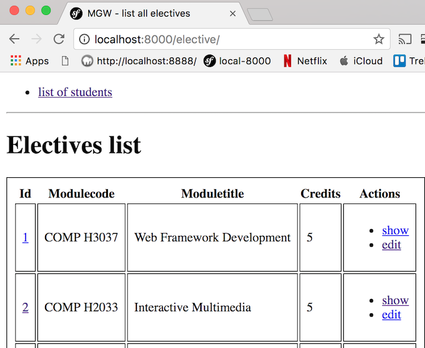

# CLI generation of CRUD controller and templates

## Symfony's CRUD generator

Symfony offers a very powerful CRUD generator command:

```php
    php bin/console generate:doctrine:crud --entity=AppBundle:Elective --format=annotation --with-write --no-interaction
```

With the single command above Symfony will generate a CRUD controller (`ElectiveController`) and also create a directory containing Twig templates (`app/Resources/views/elective/index.html.twig` etc.).

## The generated CRUD controller

Let's first look at the namespaces and class declaration line:

```php
    <?php

    namespace AppBundle\Controller;

    use AppBundle\Entity\Elective;
    use Symfony\Bundle\FrameworkBundle\Controller\Controller;
    use Sensio\Bundle\FrameworkExtraBundle\Configuration\Method;
    use Sensio\Bundle\FrameworkExtraBundle\Configuration\Route;use Symfony\Component\HttpFoundation\Request;

    /**
     * Elective controller.
     *
     * @Route("elective")
     */
    class ElectiveController extends Controller
    {
```

Above we see a set of `use` statements, and then an interesting class comment. The `@Route` annotation comment declares a route 'prefix' which will at the beginning of any `@Route` annotations for individual controller methods. So, for example, the new action will have the route `/elective/new`.

If we look in directory `app/Resources/views/elective/` we'll see the following generated templates:

```
    edit.html.twig
    index.html.twig
    new.html.twig
    show.html.twig
```

Note that all these generated templates extend Twig class `base.html.twig`. If we want to continue using the identifier `_base.html.twig`, then we'll need to edit each of these generated templates to correct the extended Twig class name.

## The generated index (a.k.a. list) controller method

Below we can see the code for `indexAction()` that retrieves and then passes an array of `Elective` objects to template `elective/index.html.twig.

```php
        /**
         * Lists all elective entities.
         *
         * @Route("/", name="elective_index")
         * @Method("GET")
         */
        public function indexAction()
        {
            $em = $this->getDoctrine()->getManager();

            $electives = $em->getRepository('AppBundle:Elective')->findAll();

            return $this->render('elective/index.html.twig', array(
                'electives' => $electives,
            ));
        }
```

If you prefer, you can re-write the last statement in the more familiar form:

```php
    $argsArray = [
        'electives' => $electives,
    ];

    $templateName = 'elective/index';
    return $this->render($templateName . '.html.twig', $argsArray);
```

Twig template `elective/index.html.twig` loops through array `electives`, wrapping HTML table row tags around each entity's content:

```html
    
        <tr>
            <td><a href="{{ path('elective_show', { 'id': elective.id }) }}">{{ elective.id }}</a></td>
            <td>{{ elective.moduleCode }}</td>
            <td>{{ elective.moduleTitle }}</td>
            <td>{{ elective.credits }}</td>
            <td>
                <ul>
                    <li>
                        <a href="{{ path('elective_show', { 'id': elective.id }) }}">show</a>
                    </li>
                    <li>
                        <a href="{{ path('elective_edit', { 'id': elective.id }) }}">edit</a>
                    </li>
                </ul>
            </td>
        </tr>
    
```

Let's create a CSS file for table borders and padding in `/web/css/table.css`;

```css
    table, tr, td {
        border: 0.1rem solid black;
        padding: 0.5rem;
    }
```

Remember in `/_base.html.twig` we have defined a block for style sheets:

```html
    <!DOCTYPE html>
    <html>
        <head>
            <meta charset="UTF-8" />
            <title>MGW - </title>

            <style>
                @import '/css/flash.css';
                
                
            </style>
```

So now we can edit template `elective/index.html.twig` to add a stylesheet block import of this CSS stylesheet:

```html
    
            @import '/css/table.css';
    
```


Figure \ref{elective_index} shows a screenshot of how our list of electives looks,rendered by the `elective/index.html.twig` template.





## The generated `newAction()` method

The method and Twig template for a new `Elective` work just as you might expect. A n empty form will be displayed and upon valida submission the user will be redirected to the `show` action form for the newly created entity.

```php

        /**
         * Creates a new elective entity.
         *
         * @Route("/new", name="elective_new")
         * @Method({"GET", "POST"})
         */
        public function newAction(Request $request)
        {
            $elective = new Elective();
            $form = $this->createForm('AppBundle\Form\ElectiveType', $elective);
            $form->handleRequest($request);

            if ($form->isSubmitted() && $form->isValid()) {
                $em = $this->getDoctrine()->getManager();
                $em->persist($elective);
                $em->flush($elective);

                return $this->redirectToRoute('elective_show', array('id' => $elective->getId()));
            }

            return $this->render('elective/new.html.twig', array(
                'elective' => $elective,
                'form' => $form->createView(),
            ));
        }

```


## The generated `showAction()` method

Initially, the generated 'show' method looks fine as jst as we might write:

```php
        /**
         * Finds and displays a elective entity.
         *
         * @Route("/{id}", name="elective_show")
         * @Method("GET")
         */
        public function showAction(Elective $elective)
        {
            $deleteForm = $this->createDeleteForm($elective);

            return $this->render('elective/show.html.twig', array(
                'elective' => $elective,
                'delete_form' => $deleteForm->createView(),
            ));
        }

```

But looking closely, we see that while the route specifies parameter `{id}`, the method declaration species a parameter of `Elective $elective`. Also the code in the method makes no reference to the `Elective` entity repository. So by some **magic** the numeric 'id' in the request path has used to retrieve the corresponding `Elective` record from the database!

This magic is the work of the Symfony 'param converter'. Also, of course, if there is no record found in table `elective` that corresponds to the recevied 'id', then a 404 not-found-exception will be thrown.

Learn more about the 'param converter' at the Symfony documentation pages:

- [](http://symfony.com/doc/current/best_practices/controllers.html#using-the-paramconverter)

## The generated `editAction()` and `deleteAction()` methods

The 'edit' and 'delete' generated methods are as you might expect. The show method creates a form, and also include code to process valid submission of the edited entity. Note that it redirects to itself upon successful save of edits.

```php
        /**
         * Displays a form to edit an existing elective entity.
         *
         * @Route("/{id}/edit", name="elective_edit")
         * @Method({"GET", "POST"})
         */
        public function editAction(Request $request, Elective $elective)
        {
            $deleteForm = $this->createDeleteForm($elective);
            $editForm = $this->createForm('AppBundle\Form\ElectiveType', $elective);
            $editForm->handleRequest($request);

            if ($editForm->isSubmitted() && $editForm->isValid()) {
                $this->getDoctrine()->getManager()->flush();

                return $this->redirectToRoute('elective_edit', array('id' => $elective->getId()));
            }

            return $this->render('elective/edit.html.twig', array(
                'elective' => $elective,
                'edit_form' => $editForm->createView(),
                'delete_form' => $deleteForm->createView(),
            ));
        }

```

The 'delete' method deletes the entity and redirects back to the list of electives for the 'index' action. Notice that an annotation comment states that this controller method is in reponse to `DELETE` method requests (more about this below).

```php
        /**
         * Deletes a elective entity.
         *
         * @Route("/{id}", name="elective_delete")
         * @Method("DELETE")
         */
        public function deleteAction(Request $request, Elective $elective)
        {
            $form = $this->createDeleteForm($elective);
            $form->handleRequest($request);

            if ($form->isSubmitted() && $form->isValid()) {
                $em = $this->getDoctrine()->getManager();
                $em->remove($elective);
                $em->flush($elective);
            }

            return $this->redirectToRoute('elective_index');
        }

```

## The generated method `createDeleteForm()`

To avoid the delete method becoming too long and complicated, a sepaerate method
 `createDeleteForm()` was generated that creates and returns a Symfony form-builder form with a 'DELETE' button simulating an HTTP DELETE method.

```php
        /**
         * Creates a form to delete a elective entity.
         *
         * @param Elective $elective The elective entity
         *
         * @return \Symfony\Component\Form\Form The form
         */
        private function createDeleteForm(Elective $elective)
        {
            return $this->createFormBuilder()
                ->setAction($this->generateUrl('elective_delete', array('id' => $elective->getId())))
                ->setMethod('DELETE')
                ->getForm()
            ;
        }
    }

```

If we actually look at the HTML source of this button-form, we can see that it is actually submitted with the HTTP `post` action, along with a hidden form field named `_method` with the value `DELETE`. This kind of approach means we can write our controllers as if they are responding to the full range of HTTP methods (`GET`, `POST`, `PUT`, `DELETE` and perhaps `PATCH`).

```html
    <form name="form" method="post" action="/elective/3">
        <input type="hidden" name="_method" value="DELETE" />
        <input type="submit" value="Delete">
        <input type="hidden" id="form__token" name="form[_token]" value="YayBB5j6Yjiyps-c6MJRxn8vHBjO-lbejF8i4034Knw" />
    </form>
```
